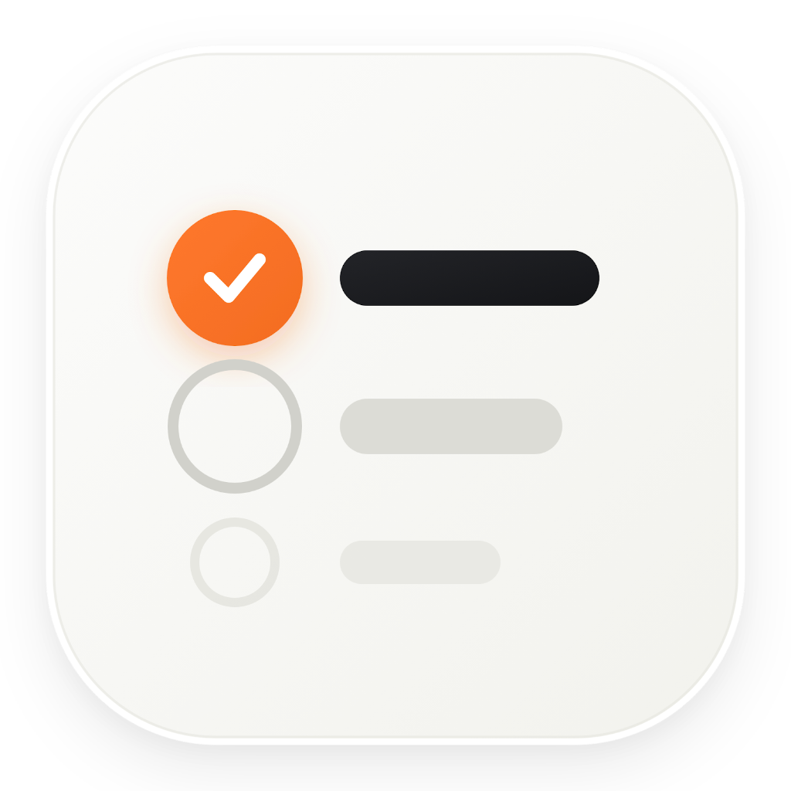
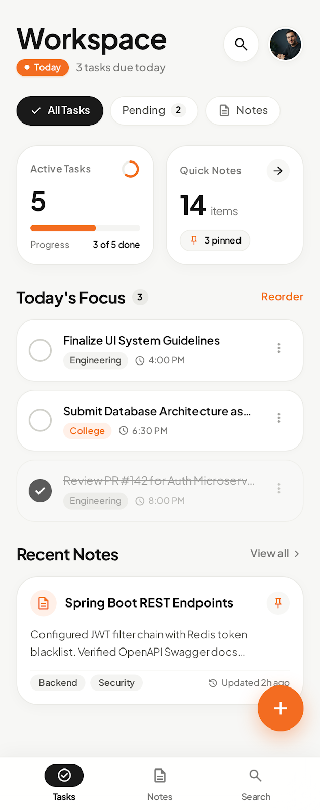

# To-do & Notes — Full-Stack Productivity Ecosystem 

<div align="center">
  
  <br/><br/>
  
  [](https://flutter.dev)
  [-3DDC84?logo=android&logoColor=white)](https://developer.android.com)
  [](https://spring.io/projects/spring-boot)
  [](https://adoptium.net)
  [](https://react.dev)
  [](https://vitejs.dev)
  [](LICENSE)

  <p align="center">
    <b>A unified productivity suite featuring a standalone Flutter mobile app, a React web dashboard, and a Java Spring Boot REST backend — styled in Warm Minimal Tactile aesthetic.</b>
  </p>
</div>

---

> [!NOTE]
> ### 💡 About This Project: Built with AI
> This entire project — spanning the **Spring Boot Java backend**, the **React web dashboard**, the **Flutter Android mobile app**, on-device storage engineering, automated build pipelines, custom app logos, and release APK compilation — was created using **Google Antigravity Agentic AI**.
> 
> I embarked on this project to explore just how powerful and autonomous modern AI coding agents have become. From writing full-stack code to solving native Android Gradle dependencies, extracting SDKs, adapting around hardware camera punch-holes, and compiling deployable 50MB production APKs, this repository serves as living proof of what paired human-AI software engineering can accomplish in record time!

---

## 📱 Live Highlights & Screenshots

| Standalone Android App | Responsive Web Dashboard |
|:---:|:---:|
|  |  |
| *Standalone Flutter APK with on-device persistence* | *React + Vite desktop workspace with live charts* |

---

## ✨ Key Features

- **📱 Standalone Mobile App (`mobile_app`)**:
  - **100% Offline-First:** Powered by on-device `SharedPreferences` key-value persistence. Zero external network or server required.
  - **Warm Minimal Tactile Design:** Cream `#F7F7F5` canvas, elevated `#FFFFFF` cards, and signature flame-orange `#F36C21` interactive accents.
  - **Hardware Adaptive (`SafeArea`):** Intelligently offsets content around Android camera punch-holes and notches without clipping text or controls.
  - **Rich Productivity Widgets:** Circular animated checkboxes, 2-column Bento metric cards (completion rates, due today), and pinned notes with tag pills.
  - **Built-in Storage Controls:** Tap the storage icon to reset demo data or clear local memory at any time.

- **💻 React Web Dashboard (`frontend`)**:
  - Built with Vite and React for instant sub-second Hot Module Replacement (HMR).
  - Bento metric grids displaying completion percentage rings and category statistics.
  - Filter tabs (All, Pending, Completed, Notes, Priority) and quick search.
  - Interactive modals for creating, editing, and managing notes.

- **☕ Spring Boot REST Backend (`backend`)**:
  - Clean 4-layer architecture: `model`, `repository`, `service`, `controller`.
  - In-memory H2 database with embedded Tomcat (zero external database installation required).
  - Pre-seeded sample records matching the mobile and web interface.
  - Full CRUD REST API with cross-origin resource sharing (`@CrossOrigin`).

---

## 🛠️ Tech Stack

| Layer | Technologies |
|---|---|
| **Mobile App** | Flutter 3.47+, Dart 3.13+, Material 3, SharedPreferences, Google Fonts (Plus Jakarta Sans) |
| **Mobile OS Target** | Android 5.0+ (API 21 to API 36), Native ARM64 & ARMv7 binaries |
| **Web Frontend** | React 18, Vite 5, Vanilla CSS Design System, Lucide Icons |
| **Backend API** | Java 17, Spring Boot 3.3.3, Spring Data JPA, Hibernate, In-Memory H2 Database |
| **Tooling & CI** | Android SDK Command-Line Tools, Gradle Kotlin DSL, Maven Wrapper |

---

## 📂 Project Structure

```text
TO_DO_-Notes_Mobile_App/
├── To-do&notes.apk               # Compiled Standalone Android Release APK (Ready to install)
├── prd.md                        # Product Requirements Document
├── DESIGN.md                     # Design tokens & tactile style guidelines
│
├── mobile_app/                   # Flutter Mobile Application
│   ├── android/                  # Native Android platform config (minSdk 21, Gradle 8.9)
│   ├── assets/                   # App icon & branding assets
│   ├── web/                      # Flutter Web preview scaffold
│   ├── lib/
│   │   ├── main.dart             # Root widget & responsive device frame wrapper
│   │   ├── theme/                # Warm Minimal color tokens (#F7F7F5, #F36C21)
│   │   ├── data/                 # Seed data matching Stitch UI
│   │   ├── models/               # Todo & Note domain models
│   │   ├── services/             # LocalStorageService (SharedPreferences)
│   │   ├── screens/              # MainScreen workspace view
│   │   └── widgets/              # Bento cards, todo cards, note cards, bottom sheets
│   └── pubspec.yaml              # Flutter dependencies
│
├── frontend/                     # React + Vite Web Dashboard
│   ├── src/
│   │   ├── components/           # Navbar, Bento Cards, TodoList, NotesGrid
│   │   ├── services/             # API client with fallback to mock data
│   │   ├── App.jsx               # Root dashboard
│   │   └── index.css             # Vanilla CSS design system
│   ├── package.json              # Web dependencies
│   └── vite.config.js            # Vite configuration
│
└── backend/                      # Spring Boot 3 Java Backend
    ├── src/main/java/com/example/todoapp/
    │   ├── model/                # JPA entities (Todo, Note)
    │   ├── repository/           # Spring Data JPA repositories
    │   ├── service/              # Business logic layer
    │   └── controller/           # REST endpoints (@CrossOrigin)
    ├── src/main/resources/       # application.properties (H2 DB configuration)
    └── pom.xml                   # Maven dependencies
```

---

## 🚀 Quick Start Guide

### 1. Install & Run Mobile App (Android APK)

To run the app immediately on your Android device without building from source:
1. Download **[`To-do&notes.apk`](To-do&notes.apk)** from the repository root.
2. Transfer the file to your Android device.
3. Tap the file to install (enable *"Install from Unknown Sources"* if prompted).
4. Launch **To-do&notes** — it runs 100% offline!

#### Building Mobile App from Source:
```bash
cd mobile_app
flutter pub get

# Run on connected phone or emulator
flutter run

# Compile release APK
flutter build apk --release
# Output: mobile_app/build/app/outputs/flutter-apk/app-release.apk
```

---

### 2. Run React Web Dashboard

```bash
cd frontend
npm install
npm run dev
```
Open **[http://localhost:5173](http://localhost:5173)** in your browser.

---

### 3. Run Spring Boot Backend (Optional)

```bash
cd backend
# On Windows:
mvnw.cmd spring-boot:run

# On macOS/Linux:
./mvnw spring-boot:run
```
- API Base URL: `http://localhost:8080/api/v1`
- H2 Database Console: `http://localhost:8080/h2-console` (JDBC URL: `jdbc:h2:mem:tododb`)

---

## 🎨 Color Palette Reference

| Token | Hex Code | Preview | Usage |
|---|---|---|---|
| **Background** | `#F7F7F5` | `rgb(247, 247, 245)` | App background canvas |
| **Surface Card** | `#FFFFFF` | `rgb(255, 255, 255)` | Elevated card surfaces |
| **Primary Accent** | `#F36C21` | `rgb(243, 108, 33)` | Flame-orange checkmarks, FAB, active pills |
| **Primary Subtle** | `#FDEEE9` | `rgb(253, 238, 233)` | Pill backgrounds, active highlights |
| **On Surface (Ink)** | `#141414` | `rgb(20, 20, 20)` | High-contrast headers & typography |
| **Subtle Border** | `#EBEBEA` | `rgb(235, 235, 234)` | Tactile card borders & dividers |

---

## 📄 License

This project is licensed under the [MIT License](LICENSE) — feel free to explore, modify, and build upon it!

---

<div align="center">
  <sub>Crafted with ❤️ by <b>Paramarth Palkar</b> using <b>Google Antigravity AI</b></sub>
</div>
